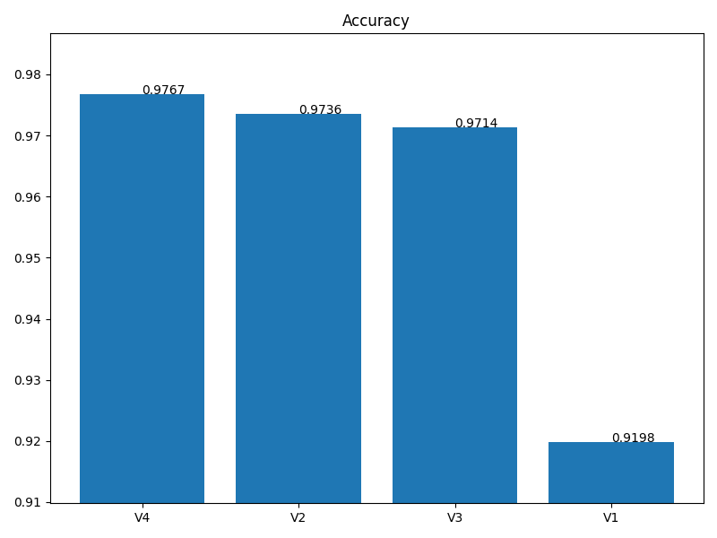
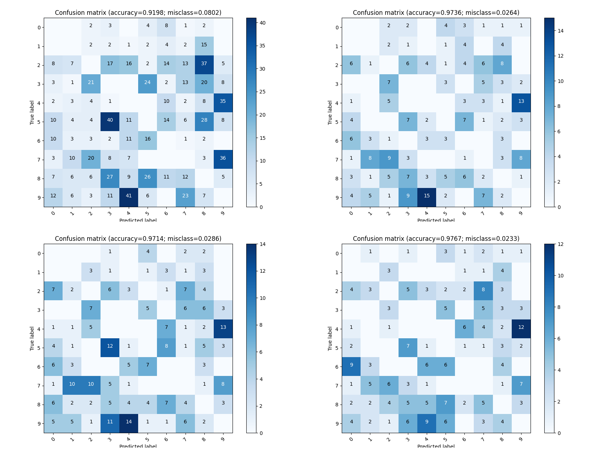
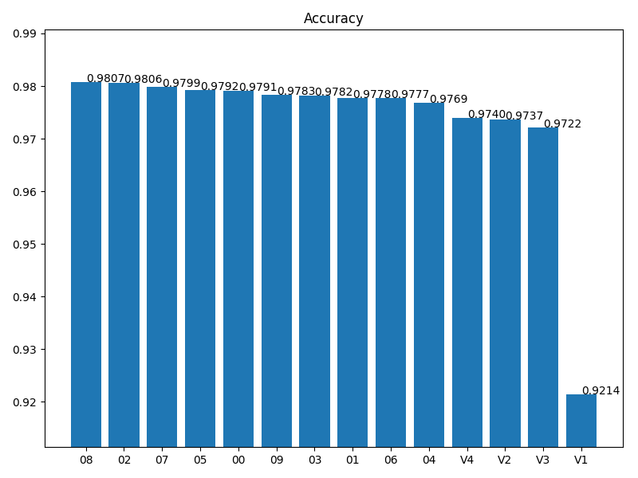
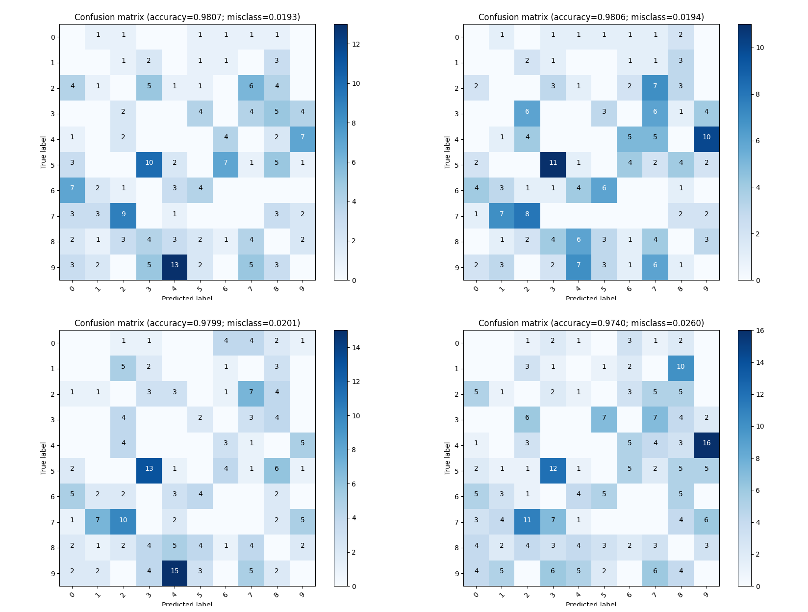

# Отчёт

Для тестирования различных вариантов нейронных сетей я решил использовать следующие условия:

- Модели получают на вход нормализированные данные в формате (28, 28). Целевые метки кодируются в one-hot encoded вектора.
- Каждая модель обучается максимум 100 эпох.
- Если модель не улучшает свой val_loss более 10 эпох, то обучение прерывается.
- Сохраняется модель с наименьшим val_loss и затем эта версия модели используется при тестировании.
- Модели получают те же самые наборы данных для валидации, чтоб полученные метрики были соизмеримы.

## Базовые модели.

Модели описаны в файле [baseline_models.py](../baseline_models.py).

Сравнение итоговой точности 4 базовых моделей:



Модель V4 даёт наибольшую итоговую точность (97.67%) и достигла этого уже на 9 эпохе. Остальные модели продолжали постепенно улучшаться на протяжение 100 эпох, но не достигли той же точности.

Матрицы ошибок моделей (исключая верные ответы и отсутствие ошибок):



Как видно, общая плотность ошибок постепенно снижается, но все модели имеют тенденцию путать "4" и "9".

## Поиск более удачной архитектуры.

Я ограничился следующими параметрами моделей:

- Все слои моделей являются Dense.
- В моделях от 2 до 5 скрытых слоёв.
- Размер каждого скрытого слоя: от 16 до 512, с шагом 32.
- Функция активации: LeakyReLU c параметром от -1.0 до 0.0 (ReLU) с шагом 0.1.
- Может присутствовать слой нормализации **перед** каждым скрытым слоем.
- **После** каждого скрытого слоя может находиться слой Dropout с параметром от 0.0 до 0.5 с шагом 0.1.
- Параметры оптимизатора изначально тоже подбирались, но отказался от этого т.к. многократно усложнялся поиск. Все модели оптимизирует Adam c `lr=1e-3`. Так же, везде `BATCH_SIZE=128`.

Поиск осуществляется Hyperband, в 3 итерации и лимитом в 30 эпох. Так же, используется досрочная остановка, если в течении 3 эпох нет улучшений `val_loss`. Это не самый оптимальный вариант, но позволяет достаточно быстро найти кандидатов для полного цикла обучения.

## Найденные модели.

Точность моделей после полного цикла обучения:



Как видно, все найденные модели превосходят baseline. Модели быстро достигали своей пиковой точности и начинали переобучаться (на 5-15 эпохе). Если уменьшить размер скрытых слоёв, то переобучение наступает позже, но модели не достигают хорошей точности.

Вот конфигурация трёх самых лучших моделей:

```
# model 08
{
  "ModelName": "tunable_V1",
  "depth": 2,
  "layer_0": 208,
  "layer_1": 176,
  "LReLuSlope": -0.4,
  "useBN": true,
  "dropout": 0.3
}

# model 02
{
  "ModelName": "tunable_V1",
  "depth": 4,
  "layer_0": 240,
  "layer_1": 240,
  "layer_2": 16,
  "layer_3": 464,
  "LReLuSlope": -0.3,
  "useBN": true,
  "dropout": 0.4
}

# model 07
{
  "ModelName": "tunable_V1",
  "depth": 3,
  "layer_0": 304,
  "layer_1": 112,
  "layer_2": 240,
  "LReLuSlope": -0.2,
  "useBN": false,
  "dropout": 0.3,
}
```

Матрицы ошибок (исключая верные ответы и отсутствие ошибок) моделей 08, 02, 07, V4:

